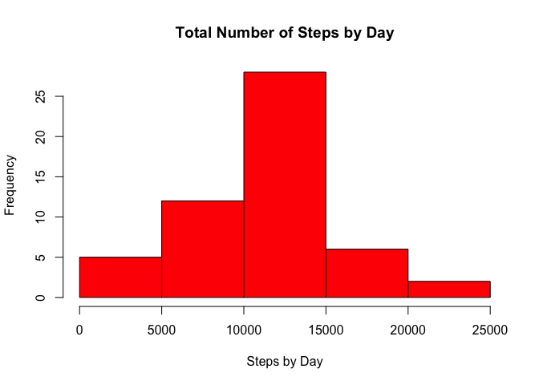
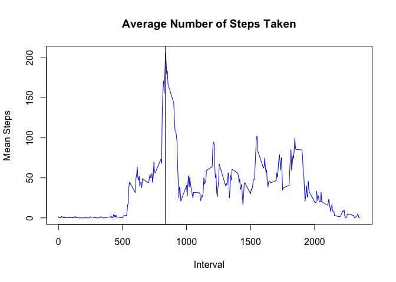
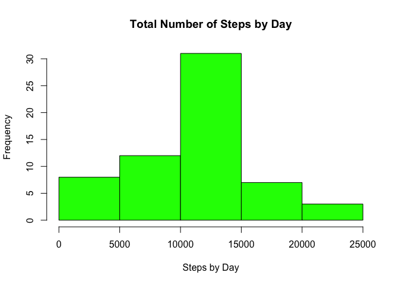
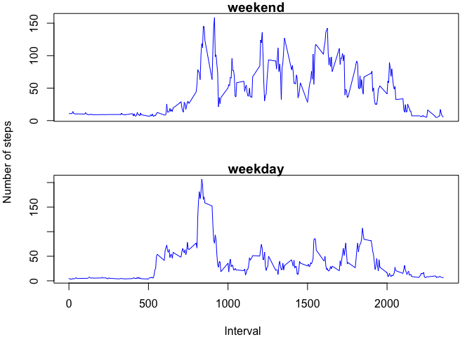

## Loading and preprocessing the data
1. Load the data

```r
unzip ("activity.zip", exdir = "./")
activity <- read.csv("activity.csv")
```
2. Process/transform the data

```r
activity$date <- as.Date(activity$date, tz="GMT")
```

```
## Warning in strptime(xx, f <- "%Y-%m-%d", tz = "GMT"): unknown timezone
## 'zone/tz/2018c.1.0/zoneinfo/America/Sao_Paulo'
```
## What is mean total number of steps taken per day?
3. Calculate the total number of steps taken per day

```r
steps_by_day <- aggregate(activity$steps,list(activity$date), sum)
```
4. Plot a histogram

```r
hist(steps_by_day$x, xlab="Steps by Day", main="Total Number of Steps by Day", col="red")
```

<!-- -->


## What is the average daily activity pattern?

5. Calculate and report the mean and median of the total number of steps taken by day

```r
print(paste("Mean number of steps taken each day: ",mean(steps_by_day$x, na.rm = TRUE)))
```

```
## [1] "Mean number of steps taken each day:  10766.1886792453"
```

```r
print(paste("Median number of steps taken each day: ",median(steps_by_day$x, na.rm = TRUE)))
```

```
## [1] "Median number of steps taken each day:  10765"
```
6. Make a time series plot of the 5-minute interval and the average number of steps across all days

```r
na_ignored <- activity[complete.cases(activity),]
mean_steps_by_date <- aggregate(na_ignored$steps,list(na_ignored$interval), mean)
plot(mean_steps_by_date$Group.1, mean_steps_by_date$x, xlab="Interval", ylab="Mean Steps", type="l", col="blue", main="Average Number of Steps Taken")
abline(v = mean_steps_by_date$Group.1[mean_steps_by_date$x == max(mean_steps_by_date$x)])
```

<!-- -->
7. Which 5-minute interval, on average across all the days in the dataset, contains the maximum number of steps?

```r
print(mean_steps_by_date$Group.1[mean_steps_by_date$x==max(mean_steps_by_date$x)])
```

```
## [1] 835
```
## Imputing missing values
1. Calculate and report the total number of missing values in the dataset

```r
print(sum(is.na(activity)))
```

```
## [1] 2304
```
2. Devise a strategy for filling in all of the missing values in the dataset
- Fill Interval NAs with mean of each day
3. Create a new dataset that is equal to the original dataset but with the missing data filled in

```r
new_dataset <- activity
merged <- merge(new_dataset,mean_steps_by_date, by.x="interval", by.y="Group.1")
new_dataset$steps[is.na(new_dataset$steps)] <- merged$x[is.na(merged$steps)]
```
4. Make a histogram of the total number of steps taken each day and calculate and report the mean and median total number of steps taken per day
4.1 Histogram

```r
steps_by_day <- aggregate(new_dataset$steps,list(new_dataset$date), sum)
hist(steps_by_day$x, xlab="Steps by Day", main="Total Number of Steps by Day", col="green")
```

<!-- -->
4.2 Mean and Median

```r
print(paste("Mean number of steps taken each day: ",mean(steps_by_day$x, na.rm = TRUE)))
```

```
## [1] "Mean number of steps taken each day:  10766.1886792453"
```

```r
print(paste("Median number of steps taken each day: ",median(steps_by_day$x, na.rm = TRUE)))
```

```
## [1] "Median number of steps taken each day:  11015"
```
## Are there differences in activity patterns between weekdays and weekends?
1. Create a new factor variable in the dataset with two levels

```r
new_dataset$day <- as.factor(ifelse(weekdays(activity$date) %in% c("Saturday", "Sunday"), "weekend", "weekday"))
```
2. Create a panel plot containing a time series plot of the 5-minute interval and the average number of steps taken

```r
plot_data <- aggregate(new_dataset$steps,list(new_dataset$day,new_dataset$interval),mean)
par(mfrow=c(2,1), mar=c(3,3,1,1), oma=c(1,1,0,0))
plot(plot_data$Group.2[plot_data$Group.1=="weekend"], main="weekend", plot_data$x[plot_data$Group.1=="weekend"], type="l", col="blue", xaxt='n',xlab="", ylab=" ")
plot(plot_data$Group.2[plot_data$Group.1=="weekday"],main="weekday", plot_data$x[plot_data$Group.1=="weekday"], type="l", col="blue",ylab=" ", xlab="Interval")
mtext("Interval", side = 1, outer = TRUE)
mtext("Number of steps", side = 2, outer = TRUE)
```

<!-- -->
